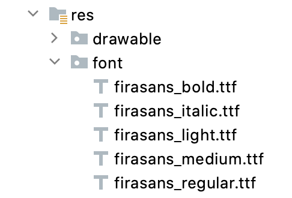

## links

[Work with fonts](https://developer.android.com/develop/ui/compose/text/fonts#downloadable-fonts)

[Custom design systems in Compose](https://developer.android.com/develop/ui/compose/designsystems/custom)


```kotlin
@Composable
fun DifferentFonts() {
    Column {
        Text("Hello World", fontFamily = FontFamily.Serif)
        Text("Hello World", fontFamily = FontFamily.SansSerif)
    }
}
```

### res/font folder:



```kotlin
val firaSansFamily = FontFamily(
    Font(R.font.firasans_light, FontWeight.Light),
    Font(R.font.firasans_regular, FontWeight.Normal),
    Font(R.font.firasans_italic, FontWeight.Normal, FontStyle.Italic),
    Font(R.font.firasans_medium, FontWeight.Medium),
    Font(R.font.firasans_bold, FontWeight.Bold)
)
```


fontFamily can include different weights, -> fontWeight

```kotlin
Column {
    Text(text = "text", fontFamily = firaSansFamily, fontWeight = FontWeight.Light)
    Text(text = "text", fontFamily = firaSansFamily, fontWeight = FontWeight.Normal)
    Text(
        text = "text",
        fontFamily = firaSansFamily,
        fontWeight = FontWeight.Normal,
        fontStyle = FontStyle.Italic
    )
    Text(text = "text", fontFamily = firaSansFamily, fontWeight = FontWeight.Medium)
    Text(text = "text", fontFamily = firaSansFamily, fontWeight = FontWeight.Bold)
}
```
